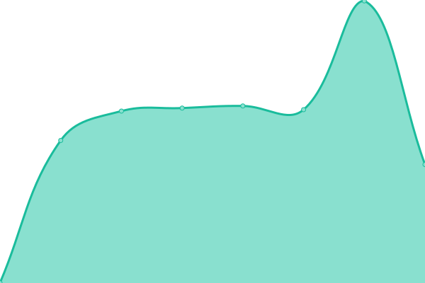
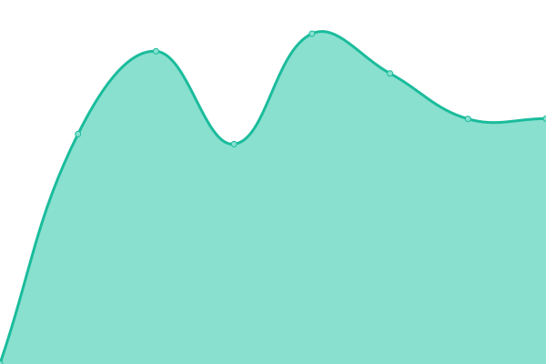

# [📈 Live Status](https://demo.upptime.js.org): <!--live status--> **🟧 Partial outage**

This repository contains the open-source uptime monitor and status page for [Pär Thernström](https://texttv.nu/), powered by [Upptime](https://github.com/upptime/upptime).

With [Upptime](https://upptime.js.org), you can get your own unlimited and free uptime monitor and status page, powered entirely by a GitHub repository. We use [Issues](https://github.com/bonny/up/issues) as incident reports, [Actions](https://github.com/bonny/up/actions) as uptime monitors, and [Pages](https://demo.upptime.js.org) for the status page.

<!--start: status pages-->
<!-- This summary is generated by Upptime (https://github.com/upptime/upptime) -->
<!-- Do not edit this manually, your changes will be overwritten -->
<!-- prettier-ignore -->
| URL | Status | History | Response Time | Uptime |
| --- | ------ | ------- | ------------- | ------ |
|  [Brottsplatskartan](https://brottsplatskartan.se) | 🟩 Up | [brottsplatskartan.yml](https://github.com/bonny/up/commits/HEAD/history/brottsplatskartan.yml) | 

 1449ms
     
 | 

<a href="https://bonny.github.io/up/history/brottsplatskartan">77.95%</a>
    

|  [TextTV.nu](https://texttv.nu) | 🟥 Down | [text-tv-nu.yml](https://github.com/bonny/up/commits/HEAD/history/text-tv-nu.yml) | 

 1024ms
     
 | 

<a href="https://bonny.github.io/up/history/text-tv-nu">70.44%</a>
    

|  [Text TV API](https://api.texttv.nu/api/get/100?app=upptime) | 🟥 Down | [text-tv-api.yml](https://github.com/bonny/up/commits/HEAD/history/text-tv-api.yml) | 

 975ms
     
 | 

<a href="https://bonny.github.io/up/history/text-tv-api">86.46%</a>
    

|  [Was ist passiert](https://wasistpassiert.com/) | 🟩 Up | [was-ist-passiert.yml](https://github.com/bonny/up/commits/HEAD/history/was-ist-passiert.yml) | 

 940ms
     
 | 

<a href="https://bonny.github.io/up/history/was-ist-passiert">100.00%</a>
    

|  [Simple History](https://simple-history.com/) | 🟩 Up | [simple-history.yml](https://github.com/bonny/up/commits/HEAD/history/simple-history.yml) | 

 876ms
     
 | 

<a href="https://bonny.github.io/up/history/simple-history">88.61%</a>
    

|  [Simple History docs](https://docs.simple-history.com/) | 🟩 Up | [simple-history-docs.yml](https://github.com/bonny/up/commits/HEAD/history/simple-history-docs.yml) | 

 699ms
     
 | 

<a href="https://bonny.github.io/up/history/simple-history-docs">88.61%</a>
    

|  [Tileserver Sweden](https://kartbilder.brottsplatskartan.se/) | 🟩 Up | [tileserver-sweden.yml](https://github.com/bonny/up/commits/HEAD/history/tileserver-sweden.yml) | 

 581ms
     
 | 

<a href="https://bonny.github.io/up/history/tileserver-sweden">74.48%</a>
    

|  [Tileserver Germany](https://germany-tileserver.brottsplatskartan.se/) | 🟩 Up | [tileserver-germany.yml](https://github.com/bonny/up/commits/HEAD/history/tileserver-germany.yml) | 

 588ms
     
 | 

<a href="https://bonny.github.io/up/history/tileserver-germany">82.22%</a>
    

|  [Eskapism](https://eskapism.se/) | 🟩 Up | [eskapism.yml](https://github.com/bonny/up/commits/HEAD/history/eskapism.yml) | 

 1044ms
     
 | 

<a href="https://bonny.github.io/up/history/eskapism">100.00%</a>
    

|  [Newbie Tech](https://newbietech.io/) | 🟩 Up | [newbie-tech.yml](https://github.com/bonny/up/commits/HEAD/history/newbie-tech.yml) | 

 451ms
     
 | 

<a href="https://bonny.github.io/up/history/newbie-tech">100.00%</a>
    

<!--end: status pages-->

[**Visit our status website →**](https://demo.upptime.js.org)

## 📄 License

- Powered by: [Upptime](https://github.com/upptime/upptime)
- Code: [MIT](./LICENSE) © [Pär Thernström](https://texttv.nu/)
- Data in the `./history` directory: [Open Database License](https://opendatacommons.org/licenses/odbl/1-0/)
